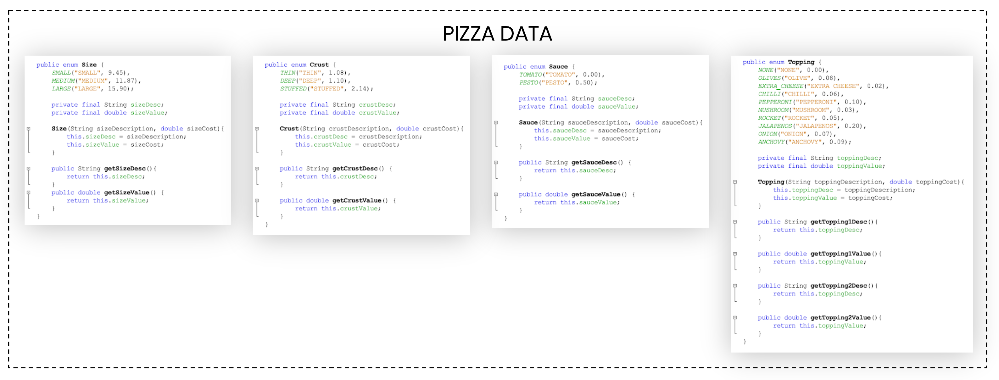

# Pizza Order Program 

This is a first-year project in which I had created a pizza ordering program that provided a simple, intuitive user interface. This project offered a great experience having learnt more about Java through object-oriented programming, having studied the fundamental concepts of classes and object as the use of enumerated data types.

Overview model of the user-interface along with the relevant data.

Extracts of the different enums created to support the application.
