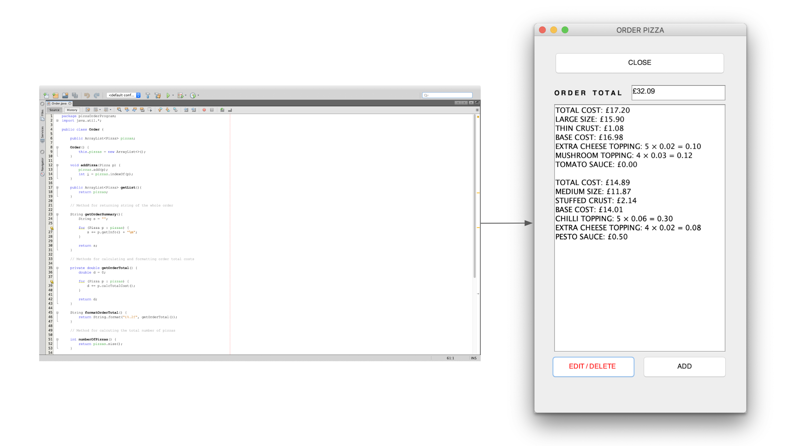
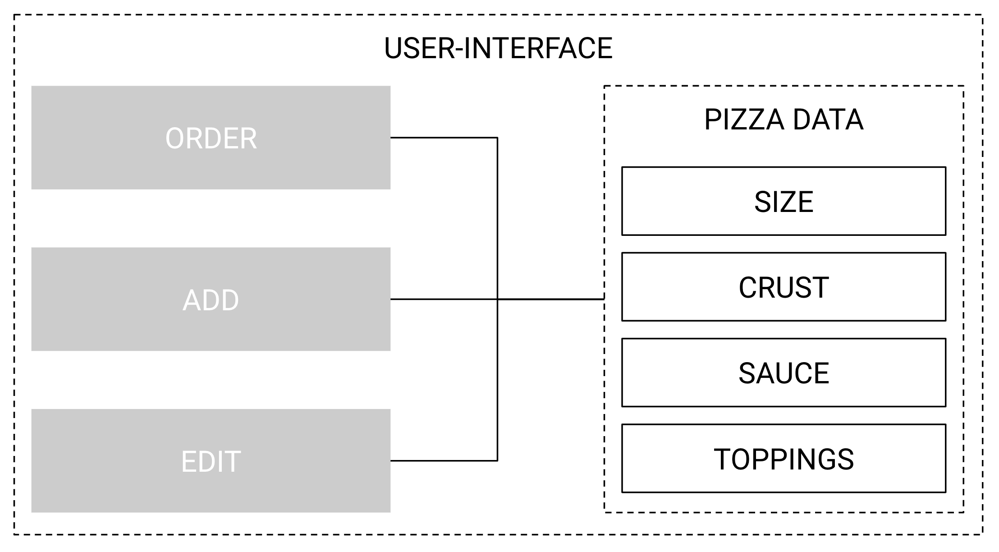

# Pizza Order Program 2018

## Overview

This is a first-year project in which I had created a pizza ordering program that provided a simple, intuitive user interface. This project offered a great experience having learnt more about Java through object-oriented programming, having studied the fundamental concepts of classes and object as the use of enumerated data types.

## Application

## User Interface Model

